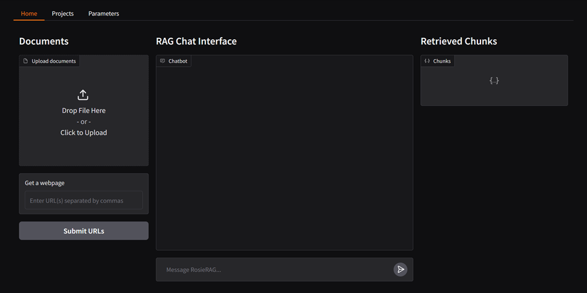

# OsireRAG

**[Democratizing Retrieval-Augmented Generation in High-Performance Computing](https://drive.google.com/file/d/1TvUJU_r4H6zoYZczTT3iytF_9bufNRMo/view?usp=sharing)**

OsireRAG is a user-friendly, containerized RAG (Retrieval-Augmented Generation) system originally designed for the ROSIE supercomputer at the Milwaukee School of Engineering (MSOE). Since it's inception, it has been expanded into the Osire ecosystem to allow users at other institutions to utilize OsireRAG. It enables students and faculty—regardless of technical background—to build, query, and manage private knowledge bases using high-performance computing (HPC) resources.

---

## 🚀 Key Features

- **Plug-and-Play Setup**: No installation or provider keys needed—works out of the box in Osire.
- **Hybrid Retrieval**: Combines semantic embeddings (MiniLM) with keyword-based BM25 for precise and relevant search results.
- **On-Premise Security**: All data remains within the user's local storage, maintaining privacy and compliance.
- **Integrated RAG Pipeline**: Full support for ingestion, chunking, embedding, retrieval, reranking, and LLM-powered Q&A.
- **Dashboard & API**: Interact through a simple Gradio-based UI or a documented REST API.
- **Optimized for Osire**: Utilizes GPU and CPU resources efficiently via Singularity containers and Open OnDemand.

---

## 🧠 Architecture

OsireRAG provides an end-to-end RAG pipeline:
1. **Ingestion**: Supports text, PDF, and raw HTML input.
2. **Chunking**: Language-aware chunking with spaCy and LangChain.
3. **Embedding**: Uses `all-MiniLM-L6-v2` for efficient semantic vector generation.
4. **Storage**: FAISS-based vector DB with export/import support.
5. **Retrieval**: Hybrid method using FAISS and BM25 + Reciprocal Rank Fusion.
6. **Reranking**: Refines results with `ms-marco-TinyBERT-L-2-v2`.

---

## 💻 HPC Integration

- Deployed via **Singularity containers** on HPC.
- Accessible via **Open OnDemand** with a FastAPI backend.
- Configured to use:
  - 1x NVIDIA T4 GPU
  - 8x CPU cores
  - LLM fallback using Llama 3.2–3B (on-device) and Llama 3.3–70B (hosted).

---

## 📈 Performance Benchmarks

| Metric             | OsireRAG | Kotaemon | dsRAG  |
|--------------------|----------|----------|--------|
| Setup Time         | None     | 3–5 min  | ≥2 min |
| Retrieval Time     | <3 sec   | <3 sec   | ~5 sec |
| Usability          | High     | Medium   | Low    |
| RAG Type           | Hybrid   | Embed    | Embed  |
| Free Usage Limits  | None     | 10 CPM   | 10 CPM |

---

## 📚 Documentation

Access complete documentation at:

- **Live Docs**: `/docs` after launching the app on OOD
- **Offline**: Inside the [`docs/`](./docs/) directory of this repository

Includes:
- Setup instructions
- System overview
- API reference
- Usage examples

---

## 🔮 Future Work

- **HyDE Integration**: Boost retrieval using synthetic query documents.
- **Conversation Memory**: Summarize and store long-running conversations.
- **Advanced Reranking**: Explore larger LLMs or analytical strategies for response ranking.

---

## 👩‍🏫 For Osire Users

No prior AI experience needed! Just launch the app from the OOD dashboard, upload your documents, and start asking questions. Your data is stored in your own user space, and all compute happens securely inside your HPC system.

---

## 🤝 Acknowledgments

This project was developed by **Adam Haile** and **Josiah Yoder** under the MSOE Department of Electrical Engineering and Computer Science.

Special thanks to the Osire team, the 2024 Policy Chatbot project, and contributors to kotaemon, dsRAG, and Langflow for their inspiration.